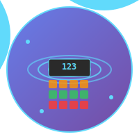

# React Calculator

A modern, responsive calculator built with React, TypeScript, and Tailwind CSS. Features a beautiful UI with smooth animations and a fully functional calculator with basic arithmetic operations.



## ✨ Features

- **Modern UI Design**: Clean, responsive interface with gradient backgrounds and smooth animations
- **Full Calculator Functionality**: Basic arithmetic operations (+, -, ×, ÷)
- **TypeScript Support**: Fully typed for better development experience
- **Tailwind CSS**: Modern utility-first CSS framework
- **React Router**: Client-side routing between pages
- **FontAwesome Icons**: Professional navigation with icons
- **Responsive Design**: Works perfectly on desktop and mobile devices

## 🚀 Live Demo

[View Live Demo](#) *(Add your deployment link here)*

## 🛠️ Technologies Used

- **React 18** - Frontend framework
- **TypeScript** - Type safety and better development experience
- **Tailwind CSS** - Utility-first CSS framework
- **React Router** - Client-side routing
- **FontAwesome** - Icon library
- **Vite** - Fast build tool and development server

## 📦 Installation

1. **Clone the repository**
   ```bash
   git clone https://github.com/yourusername/react-calculator.git
   cd react-calculator
   ```

2. **Install dependencies**
   ```bash
   npm install
   ```

3. **Start the development server**
   ```bash
   npm run dev
   ```

4. **Open your browser**
   Navigate to `http://localhost:5173` to view the application

## 🏗️ Project Structure

```
react-calculator/
├── public/
├── src/
│   ├── assets/
│   │   └── react-calculator-logo.svg
│   ├── components/
│   │   ├── CalculatorUI.tsx
│   │   └── NavBarUI.tsx
│   ├── App.tsx
│   ├── main.tsx
│   └── index.css
├── package.json
└── README.md
```

## 🎯 Features Breakdown

### Calculator Functionality
- **Number Input**: Click number buttons to input values
- **Basic Operations**: Addition, subtraction, multiplication, division
- **Clear Function**: Reset calculator state
- **Decimal Support**: Handle decimal numbers
- **Real-time Display**: Shows current input and equation history

### UI/UX Features
- **Dark Theme**: Modern dark calculator interface
- **Color-coded Buttons**: 
  - Orange for operators
  - Red for clear function
  - Green for equals
  - Gray for numbers
- **Hover Effects**: Smooth scale animations on button hover
- **Responsive Design**: Adapts to different screen sizes

### Navigation
- **Home Page**: Welcome screen with navigation button
- **Calculator Page**: Full calculator functionality
- **Navigation Bar**: Professional navigation with icons

## 🎨 Customization

### Styling
The app uses Tailwind CSS classes. You can customize the appearance by modifying the classes in the components:

```jsx
// Example: Change button colors
className="bg-blue-500 hover:bg-blue-600"
```

### Calculator Logic
The calculator logic is in `src/components/CalculatorUI.tsx`. You can extend it by:

- Adding more operations (square root, percentage, etc.)
- Implementing memory functions
- Adding keyboard support

## 📱 Browser Support

- Chrome (latest)
- Firefox (latest)
- Safari (latest)
- Edge (latest)

## 🚀 Deployment

### Vercel (Recommended)
1. Push your code to GitHub
2. Connect your repository to Vercel
3. Deploy automatically

### Netlify
1. Build the project: `npm run build`
2. Upload the `dist` folder to Netlify

### GitHub Pages
1. Add `"homepage": "https://yourusername.github.io/react-calculator"` to package.json
2. Install gh-pages: `npm install --save-dev gh-pages`
3. Add deploy script: `"deploy": "gh-pages -d dist"`
4. Run: `npm run build && npm run deploy`

## 🤝 Contributing

1. Fork the repository
2. Create a feature branch: `git checkout -b feature/amazing-feature`
3. Commit your changes: `git commit -m 'Add amazing feature'`
4. Push to the branch: `git push origin feature/amazing-feature`
5. Open a Pull Request

## 📄 License

This project is licensed under the MIT License - see the [LICENSE](LICENSE) file for details.

## 🙏 Acknowledgments

- [React](https://reactjs.org/) - The web framework used
- [Tailwind CSS](https://tailwindcss.com/) - The CSS framework
- [FontAwesome](https://fontawesome.com/) - The icon library
- [Vite](https://vitejs.dev/) - The build tool

## 📞 Contact

- **GitHub**: [@Barocode3002](https://github.com/Barocode3002)
- **Email**: mohen.m.barokha@gmail.com
- **Project Link**: [https://github.com/Barocode3002/react-calculator](https://github.com/Barocode3002/react-calculator)

---

⭐ **Star this repository if you found it helpful!**
